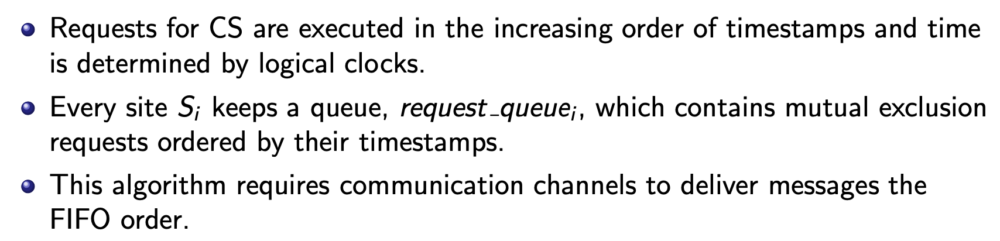
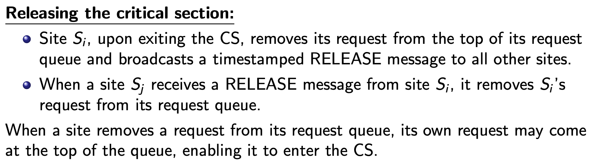

# DistributedOS-ClocksSync-MulticastOrdering-MutualExclusion-COMMIT

## Environments:

All tests are on Ubuntu 16.04 LTS, g++ (Ubuntu 5.4.0-6ubuntu1~16.04.12) 5.4.0 20160609. -std=c++11

# 1. Proj2 Clocks Synchronization, Multicast Ordering, and Mutual Exclusion, COMMIT - Requirement

In this programming project, you will develop an n-node distributed system that provides a causally ordered multicasting service and a distributed locking scheme. The distributed system uses logical clock to timestamp messages sent/received between nodes. To start the distributed system, each node should synchronize their logical clocks to the same initial value, based on which the ordering of events can be determined among the machines. For causal ordered multicasting you can use the algorithm discussed in class.

Additionally, suppose the distributed nodes have read and write access to a shared file. The last task is to implement a distributed locking scheme that prevents concurrent accesses to the shared file (this is an extra credit bonus assignment). You can use the centralized, decentralized, or the distributed algorithm to realize mutual exclusive access to the file. To simplify the design and testing, the distributed system will be emulated using multiple processes on a single machine. Each process represents a machine and has a unique port number for communication.

## 1.1 Assignment-1 (60pts) 
Suppose the logical clock on each machine represents the number of messages have been sent and received by this machine. It is actually a counter used by the process (or the machine emulator) to count events. Randomly initialize the logical clock of individual processes and use Berkeley’s algorithm to synchronize these clocks to the average clock. You can select any process as the time daemon to initiate the clock synchronization. After the synchronization, each process prints out its logical clock to check the result of synchronization.

## 1.2 Assignment-2 (40pts) 
Implement the causal ordered multicasting for the distributed system. Create two threads for each process, one for sending the multicast message to other nodes and one for listening to its communication port. Use vector clocks to enforce the order of messages. Once a process delivers a received message to a user, it prints out the message on screen. You can assume that the number of processes (machines) is fixed (equal to or larger than 3) and processes will not fail, join, or leave the distributed system. Implement two versions of this program, one without causally ordered multicasting and one with this feature. Compare the results of the two programs.

## 1.3 Bonus assignment (20pts) 
Add the feature of distributed locking to your program to protect a shared file. The file only contains a counter that can be read and updated by processes. Implement two operations: acquire and release on a lock variable to protect the file. At the beginning, each process opens the file and tries to update the counter in the file and verifies the update. Thus, the critical section includes the following operations: (1) point the file offset to the counter; (2) update the counter; (3) read and print out the counter value. You can use any of the mutual exclusion algorithm learned in class to implement the locking. The expected result is that the read of the counter value always matches the updated value by a process if locking is enabled.

# 2. Phase 1 - Assignment 1 Clock Synchronization, Berkeley Algorithm

The Background Knowledge Review and my Implementation for this part is at this repo ["berkeley-algorithm-implementation"](https://github.com/DayuanTan/berkeley-algorithm-implementation/blob/main/README.md).

# 3. Phase 2 - Assignment 2 Multicast Programming 

The Background Knowledge Review and my Implementation for this part is at this repo ["Multicast Programming and Multicast Ordering Implementation"](https://github.com/DayuanTan/multicast-programming-multicast-ordering).

1. Phase 2.0, Firstly I Implemented multicast programming for 1 sender and multiple receivers using sender.cpp and receiver.cpp files.
2. Phase 2.1, Secondly I merged them into one process with 2 threads. One for sending messages while another one for continuously receiving messages from multicast group. This is required in assignment 2.

# 4. Phase 3 - Assignment 2 Multicast Ordering

3. Thridly I implemented FIFO ordering, causal ordering and total ordering based on phase 2.1.

# 5. Phase 4 - Assignment 3 Mutual Exlcusion

## 2.4 Mutual exclusion

- Mutual exclusion: is a concurrency control property which is introduced to prevent race conditions. 
- Critical section: code only one thread/process can execute at a time 
- Lock: mechanism for mutual exclusion. Lock entering critical section, accessing shared data. Unlock when complete. Wait if locked.

For single machine, we can use shared variable (like semaphores) to share the status of shared-resources and user, because these data are all in memory or shared memory.

For DS, no shared memory are avaiable, message passing is the sole means for implementing distributed mutual exclusion [[1]](https://www.cs.uic.edu/~ajayk/Chapter9.pdf).

Three basic approaches for distributed mutual exclusion:
1. Token based approach
2. Non-token based approach (like Lamport's algorithm)
3. Quorum based approach

More algorithm introduction about above three types of approaches refer to [[2]](https://www.geeksforgeeks.org/mutual-exclusion-in-distributed-system/?ref=lbp).

## 2.5 Lamport's algorithm

The algorithm discussed in requirement of bonus assignment and in prof's slide is Lamport's algorithm.

[(These images credit to Prof. Ajay Kshemkalyani.)](https://www.cs.uic.edu/~ajayk/Chapter9.pdf)

## 3.3 Steps for assignment 3 bounus assignment - Mutual exclusion in DS

Reference:

1. [multi-process fork()](https://www.geeksforgeeks.org/creating-multiple-process-using-fork/)
2. [Multicast](https://tldp.org/HOWTO/Multicast-HOWTO-6.html)
3. [Multicast Sockets - Programming Tips](http://www.cs.unc.edu/~jeffay/dirt/FAQ/comp249-001-F99/mcast-socket.html)
4. [NETWORK PROGRAMMING LINUX SOCKET PART 13: MULTICAST (I feel this one most useful)](https://www.tenouk.com/Module41c.html)
5. [Oracle Using Multicast - send, receive IPv4 Multicast Datagrams](https://docs.oracle.com/cd/E23824_01/html/821-1602/sockets-137.html)
6. [Linux man7 socket(7) - Linux socket interface, overview, SOL_SOCKET socket options list](https://man7.org/linux/man-pages/man7/socket.7.html)
7. [Linux man7 IPv4 protocol implementation, protocol options list](https://man7.org/linux/man-pages/man7/ip.7.html)
8. [Linux man7 getsockopt, setsockopt - get and set options on sockets](https://man7.org/linux/man-pages/man2/setsockopt.2.html)
9. [Linux man7 socket(2) - create an endpoint for communication](https://man7.org/linux/man-pages/man2/socket.2.html)
10. [POSIX man7 setsockopt — set the socket options](https://man7.org/linux/man-pages/man3/setsockopt.3p.html)
